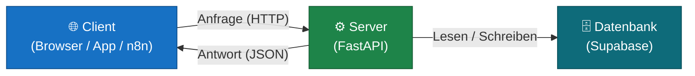
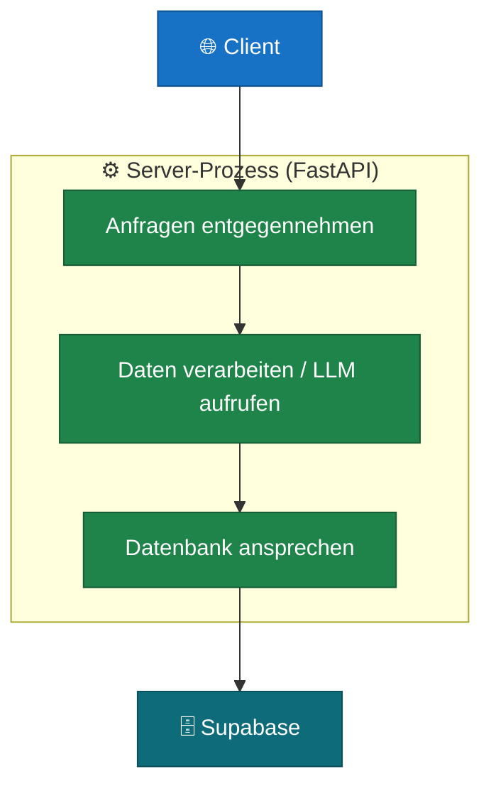

# Client & Server — das Grundprinzip

Bevor du eine eigene Anwendung baust, musst du verstehen wie zwei Programme miteinander kommunizieren. Dieses Kapitel erklärt das Grundprinzip hinter jedem Web-Service.

---

## Was ist ein Client?

Ein **Client** ist jedes Programm, das etwas anfragt:
- ein Browser (du rufst eine Website auf)
- eine mobile App
- ein Automatisierungs-Workflow (z.B. n8n)
- ein Skript, das automatisch Daten abruft

Der Client weiß: *ich will etwas haben oder tun lassen*. Er schickt eine Anfrage und wartet auf eine Antwort.

## Was ist ein Server?

Ein **Server** ist ein Programm, das dauerhaft läuft, auf Anfragen wartet und antwortet. Er:
- empfängt die Anfrage
- verarbeitet sie (fragt die Datenbank an, ruft ein LLM auf, berechnet etwas)
- schickt eine strukturierte Antwort zurück

Die Kommunikation läuft über **HTTP** — dasselbe Protokoll, das dein Browser benutzt wenn du eine Website aufrufst. Daten werden meistens als **JSON** übertragen, ein einfaches Textformat für strukturierte Informationen.

---

## Was ist ein Monolith?

Ein **Monolith** ist eine Server-Anwendung, bei der der gesamte Code in einem einzigen Programm läuft. Alle Funktionen — Anfragen entgegennehmen, Daten verarbeiten, LLM aufrufen, in die Datenbank schreiben — sind Teil desselben Prozesses.

Das klingt nach wenig Struktur, ist aber für die meisten Anwendungen **die richtige Wahl**:
- einfach zu starten und zu entwickeln
- einfach zu deployen — ein Prozess, eine Konfiguration
- einfach zu debuggen — alles an einem Ort

Das Gegenteil sind **Microservices**: viele kleine Server, die miteinander kommunizieren. Das bringt erhebliche Komplexität mit sich und lohnt sich erst bei sehr großen Teams oder sehr hohem Traffic.

> **Faustregel:** Fang mit einem Monolithen an. Wenn ein einzelner Teil des Systems so stark belastet wird, dass er die anderen bremst — dann ist der richtige Moment, ihn auszulagern. Nicht früher.

---

## Was ist eine API?

**API** steht für *Application Programming Interface* — eine definierte Schnittstelle, über die Programme miteinander kommunizieren. Dein Server ist eine API: er stellt Endpunkte bereit, die Clients aufrufen können.

Ein **Endpunkt** ist eine URL mit einer bestimmten Funktion, z.B.:
- `POST /chat` — schickt eine Nachricht an den KI-Assistenten
- `GET /tickets` — listet alle offenen Aufgaben
- `GET /health` — prüft ob der Server läuft

Der Client schickt eine HTTP-Anfrage an diesen Endpunkt, der Server antwortet mit einem JSON-Objekt.

---

## Wann reicht dieser Ansatz?

Für fast alles, was du im Kurs und darüber hinaus baust:

| Anwendungstyp | Monolith ausreichend? |
|---|---|
| LLM-Chatbot / KI-Assistent | ✅ |
| Support-System, internes Tool | ✅ |
| Aufgabenverwaltung mit Automatisierung | ✅ |
| Prototyp oder MVP | ✅ |
| Plattform mit > 50 Entwicklern | Eher Microservices |
| Dienst mit Millionen gleichzeitiger Nutzer | Eher Microservices |

Für den Einstieg und die meisten realen Projekte gilt: ein gut strukturierter Monolith ist die bessere Wahl als ein schlecht strukturiertes Microservices-System.
