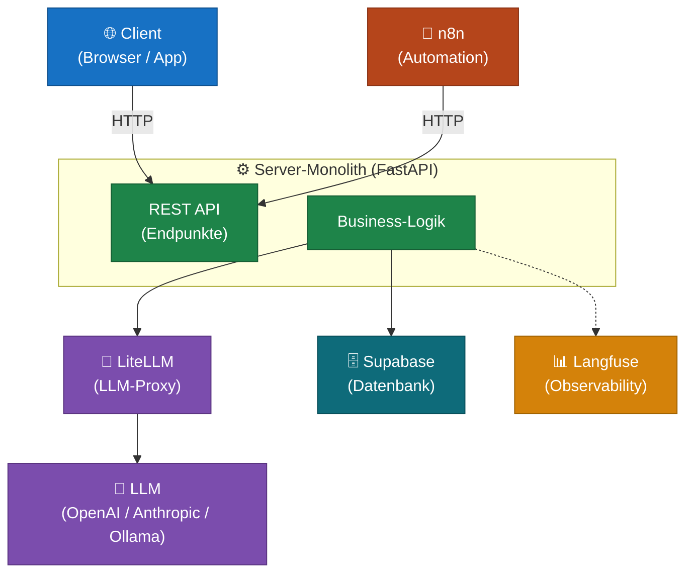
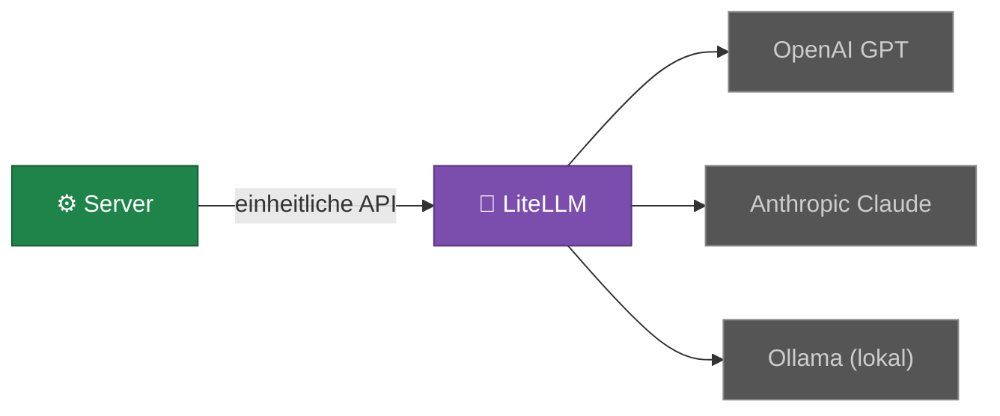
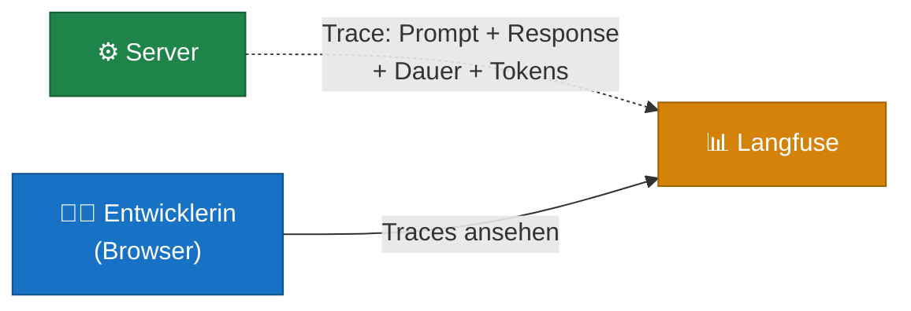
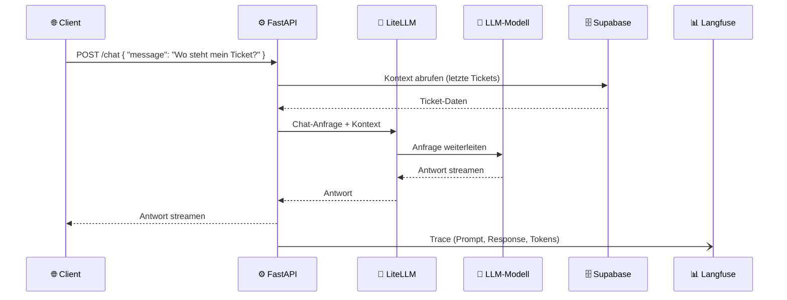

# Tech-Stack im Überblick

Eine LLM-fähige Anwendung besteht aus mehreren Bausteinen, die zusammenspielen. Dieses Kapitel erklärt jeden Baustein — was er tut, warum er im Stack ist und wie er mit den anderen zusammenhängt.

---

## Der Stack auf einen Blick



Der gestrichelte Pfeil zu Langfuse bedeutet: Tracing-Daten werden mitgeschickt, sind aber kein Teil des eigentlichen Datenflusses.

---

## FastAPI — der Server

**FastAPI** ist ein Python-Framework für den Aufbau von APIs. Es ist der Kern des Systems: hier landen alle Anfragen, hier läuft die Business-Logik.

Warum FastAPI?
- Python — gleiche Sprache wie die meisten KI- und ML-Tools
- Schnell in der Entwicklung: eine Route ist in wenigen Zeilen definiert
- Automatische API-Dokumentation (Swagger UI) eingebaut
- Gut geeignet für asynchrone Operationen (wichtig bei LLM-Calls, die mehrere Sekunden dauern können)

```python
# Beispiel: eine einfache Route
@app.post("/chat")
async def chat(message: str):
    response = await llm.call(message)
    return {"reply": response}
```

---

## LiteLLM — der LLM-Vermittler

**LiteLLM** ist ein Proxy, der zwischen deinem Server und den LLM-Anbietern sitzt. Dein Code spricht immer mit LiteLLM — LiteLLM leitet weiter an OpenAI, Anthropic, ein lokales Ollama-Modell oder andere Anbieter.



Warum LiteLLM?
- **Anbieterwechsel ohne Code-Änderung** — du tauschst das Modell in der Konfiguration, nicht im Code
- **Lokale Entwicklung** — Ollama lokal, OpenAI in Produktion, gleicher Code
- **Kostenübersicht** — LiteLLM protokolliert Token-Verbrauch und Kosten

---

## Supabase — die Datenbank

**Supabase** ist eine PostgreSQL-Datenbank mit eingebautem Studio (Web-UI), Auth-System und REST-API. Es ist keine vereinfachte oder abgespeckte Datenbank — es ist vollständiges PostgreSQL plus Werkzeuge drumherum.

Was Supabase mitbringt:

| Komponente | Funktion |
|---|---|
| PostgreSQL | Vollständige relationale Datenbank |
| Studio | Web-UI zum Browsen und Editieren der Daten |
| Auth | User-Verwaltung, Rollen, JWT-Tokens |
| Storage | Datei-Upload (Bilder, Dokumente) |
| Realtime | Live-Updates im Browser via WebSocket |
| REST API | Automatisch aus dem Schema generiert |

Warum Supabase für den Einstieg?
- Lokal via Docker startbar (kein Cloud-Account nötig)
- Studio macht die Datenbank sichtbar — kein SQL-Client nötig
- Migrations-Workflow für sauberes Schema-Management

---

## Langfuse — das Monitoring

**Langfuse** ist ein Observability-Tool speziell für LLM-Anwendungen. Es zeichnet auf, was dein System mit dem LLM gemacht hat: welche Prompts wurden geschickt, welche Antworten kamen zurück, wie lange hat es gedauert, was hat es gekostet.

Warum ist das wichtig? LLM-Anwendungen sind schwerer zu debuggen als normale Software — du siehst nicht sofort, warum ein Modell eine bestimmte Antwort gegeben hat. Langfuse macht das Innenleben sichtbar.



Langfuse läuft lokal (Docker) oder als Cloud-Service. Der Code-Aufwand für die Integration ist gering — meist reicht eine Middleware-Zeile.

---

## n8n — die Automatisierung

**n8n** ist ein Workflow-Automatisierungs-Tool. Es verbindet externe Dienste miteinander und kann deinen Server als Schritt in einem Workflow aufrufen.

In diesem Stack ist n8n ein **externer Actor**: er ruft deine FastAPI per HTTP auf, genau wie ein Browser das tun würde. Aus Sicht des Servers gibt es keinen Unterschied.

Typische Einsatzszenarien:
- Neuer Eintrag in einer Tabelle → n8n schickt eine E-Mail-Benachrichtigung
- Täglich um 9 Uhr → n8n ruft einen Report-Endpunkt auf und schickt das Ergebnis
- Eingehende Webhook-Daten → n8n verarbeitet und übergibt an den Server

Mehr zu n8n: [n8n Learning](../n8n_learning/)

---

## Wie alles zusammenspielt

Ein vollständiger Ablauf — Nutzer stellt eine Frage, der KI-Assistent antwortet:



Jeder Baustein hat genau eine Aufgabe. Das macht das System wartbar: du kannst das LLM-Modell tauschen (LiteLLM-Konfiguration), die Datenbank-Struktur ändern (Supabase-Migration) oder einen Endpunkt anpassen (FastAPI-Route) — ohne die anderen Teile anzufassen.
