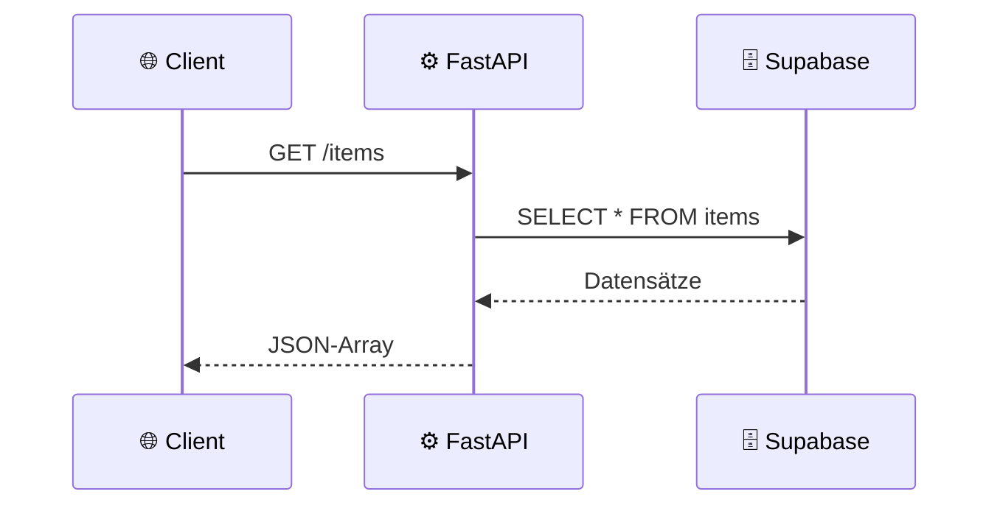
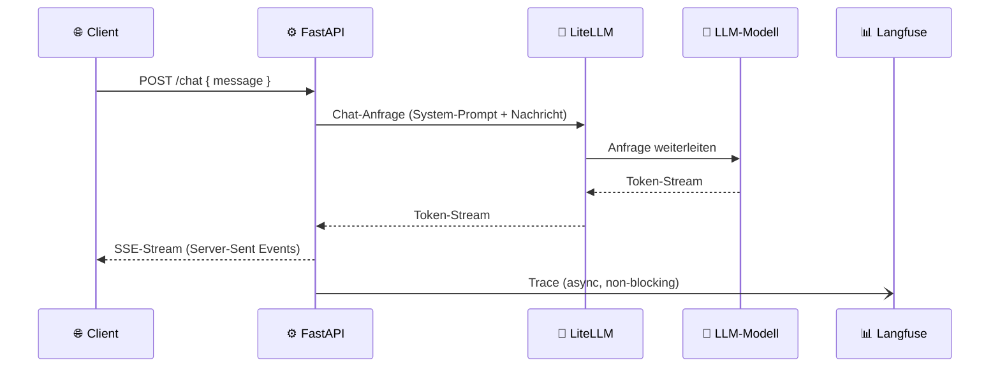
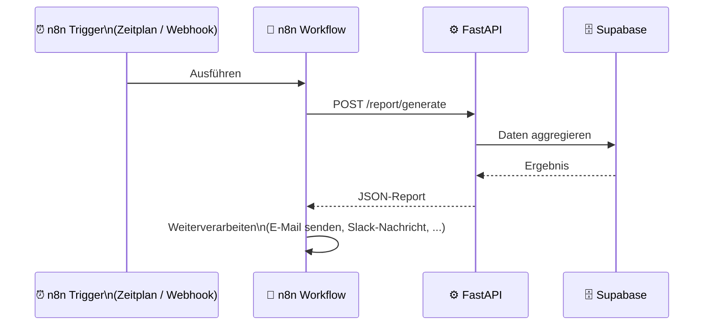
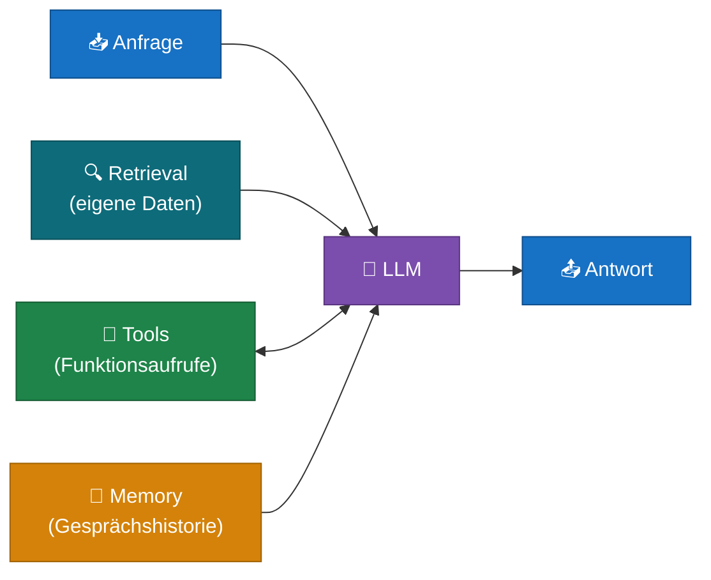
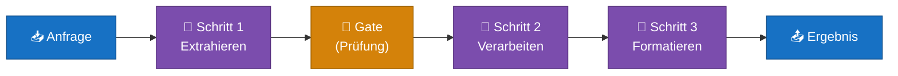
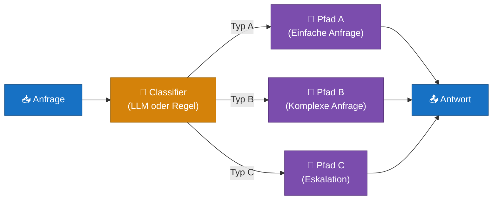
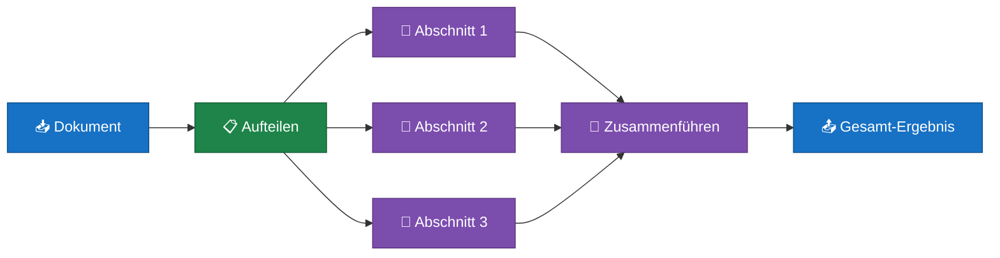
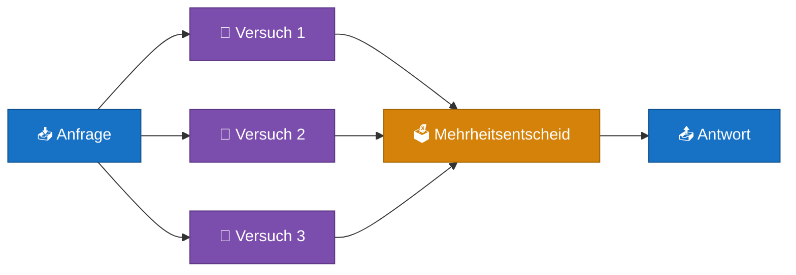
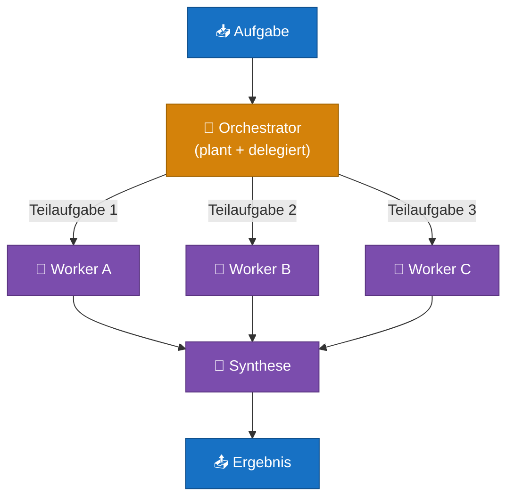

# Kommunikationsflüsse

Dieses Kapitel zeigt, wie die Bausteine des Stacks miteinander kommunizieren — von einfachen API-Calls bis zu komplexen Automatisierungsabläufen. Im zweiten Teil: die sechs Architektur-Patterns für LLM-Anwendungen nach Anthropic.

---

## 1. Der einfachste Fall: Client → API → Datenbank

Ein Client fragt Daten an, der Server liest aus der Datenbank und antwortet.

Das ist das Grundmuster. Alle anderen Flows bauen darauf auf.

---

## 2. Mit LLM — API → LiteLLM → Modell

Wenn eine Anfrage KI-Verarbeitung braucht, wird LiteLLM eingebunden. Langfuse zeichnet den Vorgang im Hintergrund auf.

**SSE (Server-Sent Events)** ist ein Protokoll für Echtzeit-Streams vom Server zum Client. Der Nutzer sieht die Antwort Wort für Wort, anstatt auf das komplette Ergebnis zu warten.

Der Trace zu Langfuse wird **asynchron** verschickt — er blockiert nicht den Antwort-Stream.

---

## 3. n8n als Automation-Actor

Aus Sicht des Servers ist n8n ein normaler Client — er schickt HTTP-Anfragen wie jeder andere. Der Server braucht nichts Besonderes zu wissen.

Mehr zu n8n-Workflows: [n8n Learning](../n8n_learning/)

---

## 4. Anthropic: Sechs Patterns für LLM-Anwendungen

> *"The most important thing is to match the architecture to the actual requirements of your task — not to use the most sophisticated pattern you can think of."*
>
> — Quelle: [Anthropic Engineering — Building Effective Agents](https://www.anthropic.com/engineering/building-effective-agents)

Bevor du einen komplexen Agenten baust, lohnt es sich zu verstehen welche Muster es gibt und wann welches passt.

### Workflows vs. Agents

| | Workflow | Agent |
|---|---|---|
| **Steuerung** | Code bestimmt den Ablauf | Das LLM entscheidet selbst |
| **Vorhersagbarkeit** | Hoch | Niedriger |
| **Flexibilität** | Begrenzt | Hoch |
| **Einsatz** | Aufgaben mit klarem Ablauf | Offene, unstrukturierte Probleme |

Für die meisten Anwendungen im M4-Kurs sind **Workflows** die richtige Wahl — strukturierter, testbarer, weniger überraschend.

---

### Pattern 1 — Augmented LLM

Das LLM wird mit zusätzlichem Kontext angereichert: Retrieval (eigene Daten), Tools (externe Funktionen) und Memory (Gesprächshistorie).

**Im Stack:** FastAPI reichert die Anfrage an (Retrieval aus Supabase, Gesprächshistorie aus der DB) bevor LiteLLM aufgerufen wird.

**Wann:** Fast immer — das ist die Basis für alle anderen Patterns.

---

### Pattern 2 — Prompt Chaining

Eine Aufgabe wird in Einzelschritte zerlegt. Jeder Schritt ist ein eigener LLM-Call, das Ergebnis fließt in den nächsten. Zwischen Schritten können Prüfungen ("Gates") eingebaut werden.

**Im Stack:** Mehrere aufeinanderfolgende LiteLLM-Calls in einem FastAPI-Endpunkt, oder als n8n-Workflow mit mehreren LLM-Nodes.

**Wann:** Aufgabe lässt sich in feste Teilschritte zerlegen (z.B. "Daten extrahieren → zusammenfassen → in Zielsprache übersetzen").

---

### Pattern 3 — Routing

Die Anfrage wird zunächst klassifiziert, dann an den passenden Folge-Prozess weitergeleitet.

**Im Stack:** FastAPI-Endpunkt klassifiziert die Anfrage (einfacher LLM-Call oder Regelwerk), dann Weiterleitung. In n8n: IF/Switch-Node nach einem Classifier-LLM-Call.

**Wann:** Anfragen fallen klar in unterschiedliche Kategorien, die verschieden behandelt werden müssen.

---

### Pattern 4 — Parallelisierung

Mehrere LLM-Calls laufen gleichzeitig. Zwei Varianten:

**Sectioning** — unabhängige Teilaufgaben parallel bearbeiten:

**Voting** — dieselbe Frage mehrfach stellen und abstimmen (für höhere Zuverlässigkeit):

**Im Stack:** Sectioning via `asyncio.gather()` in FastAPI. Voting selten nötig, aber mit n8n gut abzubilden.

**Wann:** Sectioning bei großen Dokumenten oder unabhängigen Teilaufgaben. Voting wenn Zuverlässigkeit kritisch ist.

---

### Pattern 5 — Orchestrator-Workers

Ein zentrales LLM (Orchestrator) plant die Aufgabe, delegiert Teilaufgaben dynamisch an Worker-LLMs und fasst die Ergebnisse zusammen.

Der Unterschied zu Parallelisierung: die Teilaufgaben werden **dynamisch** bestimmt — der Orchestrator entscheidet erst zur Laufzeit, was getan werden muss.

**Im Stack:** FastAPI-Endpunkt mit mehreren LiteLLM-Calls in einer gesteuerten Schleife.

**Wann:** Komplexe Aufgaben deren Teilschritte nicht im Voraus feststehen (z.B. Code-Analyse über mehrere Dateien).

---

### Pattern 6 — Evaluator-Optimizer

Ein LLM generiert eine Antwort, ein zweites bewertet sie — in einer Schleife, bis die Qualität ausreicht.

**Im Stack:** Zwei LiteLLM-Calls in einer FastAPI-Funktion — einer generiert, einer bewertet. Schleife mit definiertem Abbruchkriterium (max. Iterationen oder Qualitätsschwelle).

**Wann:** Es gibt klare Qualitätskriterien, und iterative Verbesserung bringt messbaren Mehrwert (z.B. Code-Generierung mit automatischer Test-Prüfung).

---

## 5. Welches Pattern passt wann?

| Pattern | Verwende es wenn... |
|---|---|
| Augmented LLM | immer — das ist die Basis |
| Prompt Chaining | die Aufgabe klar in Schritte zerfällt |
| Routing | Anfragen in verschiedene Kategorien fallen |
| Parallelisierung | unabhängige Teilaufgaben gleichzeitig bearbeitbar sind |
| Orchestrator-Workers | die Aufgabe dynamisch zerlegt werden muss |
| Evaluator-Optimizer | Qualität messbar und iterativ verbesserbar ist |

> **Empfehlung für den Einstieg:** Fang mit Augmented LLM an. Füge Prompt Chaining hinzu, wenn ein einzelner Call nicht ausreicht. Nur wenn das nicht mehr genug ist, wechsle zu komplexeren Patterns.

Quelle: [Anthropic Engineering — Building Effective Agents](https://www.anthropic.com/engineering/building-effective-agents)
