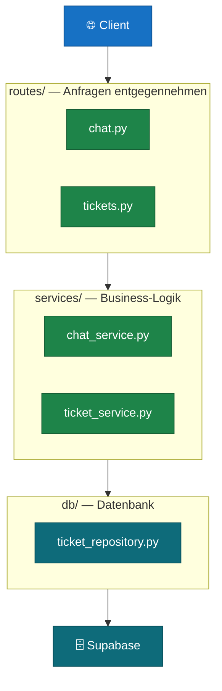
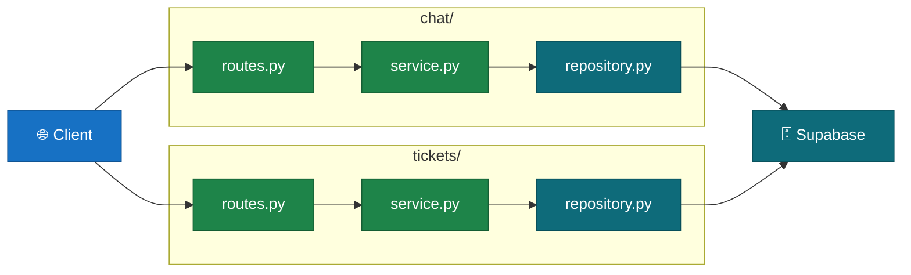

# Server-Struktur: Code organisieren

Wenn dein Server wächst, stellt sich die Frage: Wie organisiere ich die Dateien? Es gibt zwei grundlegende Ansätze — **package-by-layer** und **package-by-feature**. Dieses Kapitel erklärt beide, zeigt ihre Stärken und Schwächen und gibt eine Empfehlung für den Einstieg.

---

## Das Problem

Ein Server mit einem einzigen Endpunkt ist einfach. Aber was, wenn er 20 Endpunkte hat, eine Datenbank-Schicht, Business-Logik, LLM-Integration und Hilfsfunktionen? Ohne Struktur entsteht schnell ein schwer wartbarer Haufen Dateien.

Das Ziel jeder Codestruktur: **gleiche Änderungen betreffen nur eine Stelle im Code**, nicht fünf verteilt über das Projekt.

---

## Ansatz 1 — Package-by-Layer

Der Code wird nach seiner **technischen Schicht** gruppiert:
- alle Routen (HTTP-Endpunkte) in einem Ordner
- alle Services (Business-Logik) in einem Ordner
- alle Datenbank-Zugriffe in einem Ordner

```
src/
├── routes/          ← HTTP-Endpunkte, Validierung
│   ├── chat.py
│   ├── tickets.py
│   └── users.py
├── services/        ← Business-Logik, LLM-Calls
│   ├── chat_service.py
│   ├── ticket_service.py
│   └── user_service.py
└── db/              ← Datenbank-Zugriffe (nur Supabase)
    ├── ticket_repository.py
    └── user_repository.py
```



**Was die drei Schichten bedeuten:**

| Schicht | Zuständigkeit | Weiß von... |
|---|---|---|
| `routes/` | HTTP, Request-Validierung, Antwort-Format | nichts über die DB |
| `services/` | Business-Logik, LLM-Calls, Orchestrierung | nichts über HTTP |
| `db/` | Supabase-Abfragen, SQL | nichts über Business-Logik |

Diese Trennung hat einen konkreten Nutzen: wenn du Supabase gegen eine andere Datenbank tauschst, änderst du nur `db/`. Der Rest bleibt unangetastet.

**Vorteile:**
- Klar, wo was liegt — neue Entwickler finden sich schnell zurecht
- Schichten sind unabhängig testbar
- Konvention ist weitverbreitet (Spring Boot, Django, Rails nutzen dasselbe Prinzip)

**Nachteile:**
- Bei Feature-Änderungen musst du oft in drei Ordnern gleichzeitig arbeiten
- Bei vielen Features werden die Ordner groß

---

## Ansatz 2 — Package-by-Feature

Der Code wird nach **fachlicher Funktion** gruppiert. Alles, was zu einem Feature gehört — Route, Service, Datenbank-Zugriff — liegt zusammen in einem Ordner.

```
src/
├── chat/
│   ├── routes.py
│   ├── service.py
│   └── repository.py
├── tickets/
│   ├── routes.py
│   ├── service.py
│   └── repository.py
└── users/
    ├── routes.py
    ├── service.py
    └── repository.py
```



**Vorteile:**
- Ein Feature hinzufügen oder löschen = einen Ordner anfassen
- Features lassen sich leichter in eigenständige Services auslagern (wenn es mal nötig wird)
- Code-Ownership klar: Team A besitzt `tickets/`, Team B `users/`

**Nachteile:**
- Dupliziertes Muster in jedem Feature-Ordner
- Für kleine Projekte mehr Overhead als nötig

---

## Vergleich auf einen Blick

| | Package-by-Layer | Package-by-Feature |
|---|---|---|
| **Code finden** | klar — ich weiß die Schicht | klar — ich weiß das Feature |
| **Feature hinzufügen** | drei Ordner anfassen | einen Ordner anfassen |
| **Feature löschen** | drei Ordner anfassen | einen Ordner löschen |
| **Team-Größe** | Solo bis kleines Team | Ab mehreren Teams |
| **Projektgröße** | Klein bis mittel | Mittel bis groß |

---

## Empfehlung für den Einstieg

**Fang mit Package-by-Layer an.** Die Schichtentrennung (`routes/`, `services/`, `db/`) ist das wichtigere Konzept — sie stellt sicher, dass dein Code wartbar bleibt, unabhängig davon wie viele Features du hinzufügst.

Wenn dein Projekt wächst und du merkst, dass du bei jeder Änderung an einem Feature immer dieselben drei Ordner öffnest — dann ist es Zeit, auf Package-by-Feature umzusteigen. Das ist kein Rückschritt, sondern eine natürliche Reifung des Projekts.

> **Wichtig:** Die Schichten selbst (`routes` → `services` → `db`) gelten in beiden Ansätzen. Package-by-Feature ändert nur die Ordner-Struktur, nicht die Schichtentrennung.
