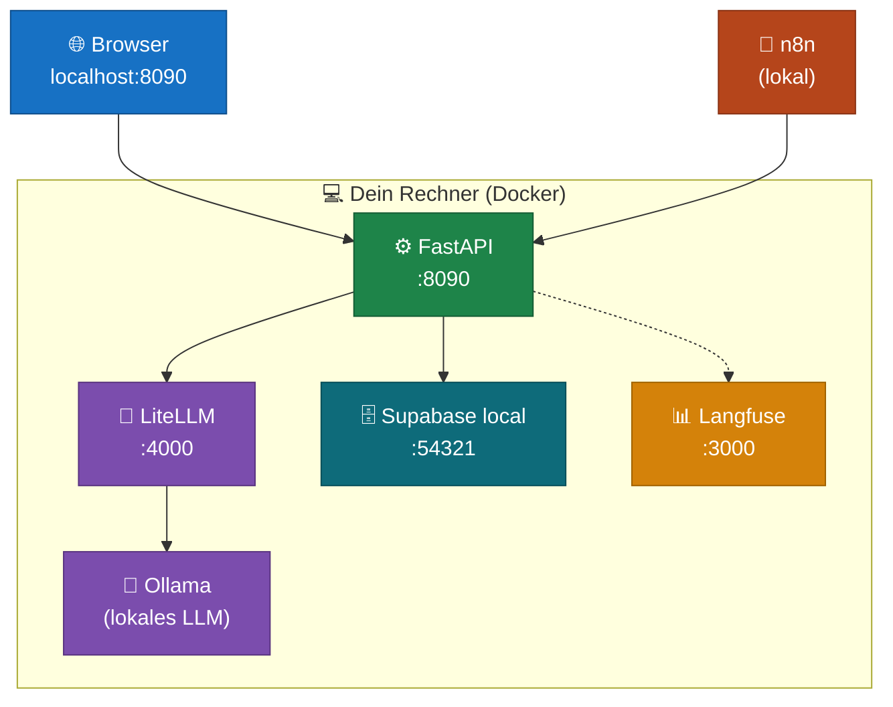
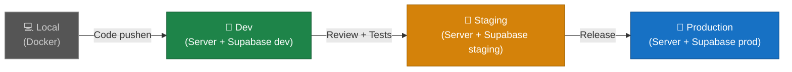
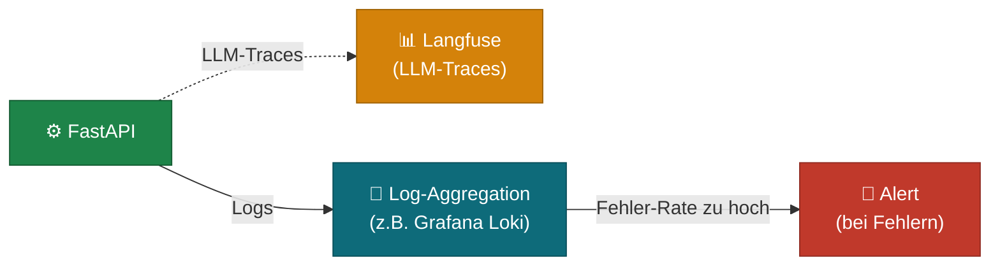

# Von lokal bis Produktion

Eine Anwendung durchläuft typischerweise drei Stufen: lokale Entwicklung, ein erster lauffähiger Endpunkt, und schließlich eine produktionsnahe Umgebung. Dieses Kapitel zeigt, wie diese Stufen aussehen und was sich jeweils ändert.

---

## Stufe 1 — Lokal (alles auf einem Rechner)

In der lokalen Entwicklung läuft alles auf deinem eigenen Rechner. Kein Cloud-Account nötig, keine laufenden Kosten, volle Kontrolle.



**Was du brauchst:**
- Docker und Docker Compose
- Die Konfigurations-Dateien der einzelnen Services
- Eine `.env`-Datei mit lokalen Werten (keine echten API-Keys nötig)

**Vorteile:**
- Schnelle Iteration — Änderungen sofort sichtbar
- Offline arbeiten möglich
- Keine Kosten

**Nachteile:**
- Läuft nur, solange dein Rechner an ist
- Nicht von außen erreichbar
- Lokale Modelle (Ollama) sind langsamer als Cloud-Modelle

**Typische `.env` für lokale Entwicklung:**

```bash
# Lokal: alles zeigt auf localhost
LITELLM_BASE_URL=http://localhost:4000
SUPABASE_URL=http://localhost:54321
LANGFUSE_HOST=http://localhost:3000

# Lokales Modell — keine API-Kosten
LLM_MODEL=ollama/llama3.2
```

---

## Stufe 2 — Hands-on: der erste Endpunkt

Bevor du das gesamte System baust, macht es Sinn mit einem einzigen Endpunkt zu starten. Das gibt dir schnelles Feedback und zeigt, ob die Grundstruktur funktioniert.

**Minimaler FastAPI-Server:**

```python
from fastapi import FastAPI

app = FastAPI()

@app.get("/health")
def health():
    return {"status": "ok"}

@app.post("/echo")
def echo(message: str):
    return {"received": message}
```

Das reicht für den ersten Start. Mit diesem Grundgerüst kannst du:
- den Server starten und im Browser testen (`/docs` öffnet die Swagger-UI)
- n8n-Workflows gegen den Server testen
- die Struktur (`routes/`, `services/`, `db/`) schrittweise aufbauen

**Iterativer Aufbau:**

```
1. /health — Server läuft?
2. /echo   — Anfragen kommen an?
3. /chat   — LLM antwortet?
4. /items  — Datenbank erreichbar?
5. ...     — Feature nach Feature
```

Jeder Schritt ist testbar, bevor der nächste gebaut wird. Fehler sind sofort lokalisierbar.

---

## Stufe 3 — Produktionsnah

Eine produktionsnahe Umgebung unterscheidet sich in drei Punkten von der lokalen Entwicklung: **Umgebungstrennung**, **Secrets-Management** und **Observability**.

### Umgebungstrennung

Typische Umgebungen und ihr Zweck:

| Umgebung | Zweck | Datenbank |
|---|---|---|
| `local` | Entwicklung auf dem eigenen Rechner | Supabase lokal |
| `dev` | Geteilte Entwicklungsumgebung | Supabase-Projekt "dev" |
| `staging` | Test vor dem Release | Supabase-Projekt "staging" |
| `production` | Echte Nutzer | Supabase-Projekt "prod" |



Jede Umgebung hat ihre eigene `.env`-Datei. Niemals teilt sich Local und Production eine Datenbank.

### Secrets-Management

Lokale Entwicklung: `.env`-Datei reicht. In Produktion: Secrets gehören nicht in Dateien auf dem Server, sondern in ein Secret-Management-System.

| Umgebung | Empfehlung |
|---|---|
| Lokal | `.env`-Datei (nicht ins Git!) |
| Server (einfach) | Umgebungsvariablen direkt gesetzt |
| Server (produktionsnah) | Secret-Manager (z.B. Doppler, 1Password Secrets, AWS Secrets Manager) |

Wichtigste Regel: **`.env`-Dateien mit echten Keys niemals ins Git-Repository.** `.env` gehört immer in `.gitignore`.

### Observability

In Produktion willst du wissen:
- Läuft der Server? (Health Check)
- Wie lange dauern Anfragen? (Latenz)
- Was kostet der LLM-Einsatz? (Token-Tracking via Langfuse)
- Welche Fehler treten auf? (Error-Logging)



Für den Einstieg reicht **Langfuse** für LLM-Tracing und strukturiertes Logging (JSON-Logs statt `print()`). Komplexeres Monitoring kommt, wenn der erste Produktiv-Traffic da ist.

---

## Zusammenfassung: Was ändert sich je Stufe?

| | Lokal | Hands-on | Produktionsnah |
|---|---|---|---|
| LLM | Ollama (lokal) | Ollama oder Cloud | Cloud (OpenAI / Anthropic) |
| Datenbank | Supabase lokal | Supabase lokal | Supabase Cloud |
| Secrets | `.env` lokal | `.env` lokal | Secret-Manager |
| Erreichbar von außen | Nein | Nein / Tunnel | Ja (eigene Domain) |
| Monitoring | Langfuse lokal | Langfuse lokal | Langfuse Cloud |
| Kosten | Keine | Keine / gering | Laufende Kosten |
