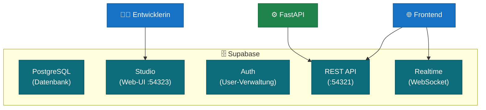
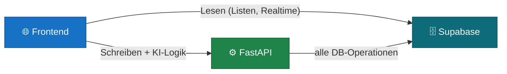
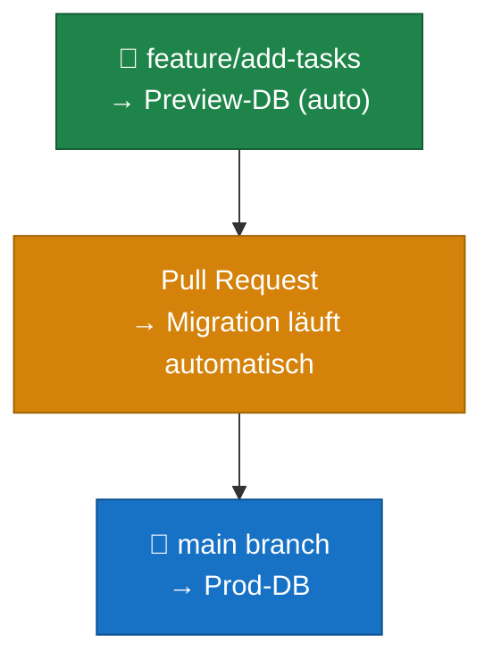

# Supabase Best Practices

> 🟡 **Aufbauend** — empfohlen nach [01–05](README.md)

Supabase ist mehr als eine Datenbank — es ist ein komplettes Backend-Toolkit auf Basis von PostgreSQL. Dieses Kapitel erklärt, was Supabase ist, wie du lokal damit arbeitest und wie du Datenbank-Änderungen sauber durch Umgebungen führst.

---

## Was ist Supabase?

Supabase ist ein Open-Source-Backend-as-a-Service, der vollständiges PostgreSQL mit zusätzlichen Werkzeugen kombiniert:

| Komponente | Was es tut |
|---|---|
| **PostgreSQL** | Vollständige relationale Datenbank — nicht abgespeckt |
| **Studio** | Web-UI: Tabellen browsen, Daten editieren, SQL ausführen |
| **Auth** | User-Verwaltung, Rollen, JWT-Tokens, OAuth-Provider |
| **Storage** | Datei-Upload und -Verwaltung (Bilder, Dokumente) |
| **Realtime** | Live-Updates im Browser via WebSocket |
| **REST API** | Automatisch aus dem Datenbankschema generiert |



Warum Supabase für den Einstieg?
- **Lokal startbar** — kein Cloud-Account für die Entwicklung nötig
- **Studio** macht die Datenbank sichtbar — kein separater SQL-Client nötig
- **Migrations-System** für nachvollziehbare Schema-Änderungen

---

## Lokale Entwicklung

Supabase läuft lokal via Docker. Die Supabase CLI verwaltet die lokale Instanz.

### Setup

```bash
# Supabase CLI installieren (einmalig)
brew install supabase/tap/supabase   # macOS
# oder: npm install -g supabase      # plattformübergreifend

# Projekt initialisieren (einmalig, im Projektordner)
supabase init

# Lokale Instanz starten
supabase start
```

Nach `supabase start` sind folgende Dienste erreichbar:

| Dienst | URL |
|---|---|
| API / REST | `http://localhost:54321` |
| Studio | `http://localhost:54323` |
| PostgreSQL direkt | `localhost:54322` |
| Inbucket (Test-E-Mails) | `http://localhost:54324` |

### Arbeiten mit Studio

Studio unter `http://localhost:54323` bietet:
- **Table Editor** — Tabellen ansehen und Daten direkt editieren
- **SQL Editor** — SQL-Abfragen ausführen
- **Auth** — Test-User anlegen und verwalten
- **API Docs** — auto-generierte Dokumentation der REST-Endpunkte

**Wichtig:** Ändere das Schema **nie** direkt über Studio in einem Produktions-Projekt. Studio ist zum Explorieren und Debuggen da — Schema-Änderungen gehören in Migrations.

---

## Migrations — Schema-Änderungen sauber verwalten

Eine **Migration** ist eine Datei, die eine Datenbankänderung beschreibt (Tabelle hinzufügen, Spalte ändern, Index erstellen). Migrations werden versioniert und können auf jede Umgebung angewendet werden.

### Neue Migration erstellen

```bash
# Migration erstellen (Datei wird in supabase/migrations/ angelegt)
supabase migration new add_tasks_table
```

Das erzeugt eine Datei wie `20260605120000_add_tasks_table.sql`. Den SQL-Code schreibst du selbst hinein:

```sql
-- supabase/migrations/20260605120000_add_tasks_table.sql

CREATE TABLE tasks (
    id UUID PRIMARY KEY DEFAULT gen_random_uuid(),
    title TEXT NOT NULL,
    status TEXT NOT NULL DEFAULT 'open',
    created_at TIMESTAMPTZ NOT NULL DEFAULT NOW()
);
```

### Migration anwenden

```bash
# Lokal anwenden
supabase db push

# Auf verknüpftes Cloud-Projekt anwenden
supabase db push --linked
```

### Migration-Workflow im Team


---

## Best Practices

### Schema-Änderungen

- **Immer via Migrations**, niemals manuell im Studio eines geteilten Projekts
- Eine Migration = eine logische Änderung (nicht mehrere unzusammenhängende Änderungen mischen)
- Migrations sind **nur vorwärts** — ein `DROP TABLE` in einer Migration löscht echte Daten; zweimal überlegen, einmal ausführen
- Sinnvolle Namen: `add_users_table`, `add_status_column_to_tasks`, nicht `migration_001`

### Datenbankzugriff aus dem Server

Dein FastAPI-Server greift über die REST API oder den Supabase Python-Client auf die Datenbank zu. **Direkte Verbindungen aus dem Frontend** (Supabase JS SDK) nur für Leseoperationen — schreibende Operationen mit Seiteneffekten laufen durch den Server.



### Secrets

Der `anon`-Key und der `service_role`-Key aus Supabase sind Passwörter — nicht ins Git-Repository.

| Key | Verwendung | Sichtbar für |
|---|---|---|
| `anon` key | Frontend, öffentliche Abfragen | Öffentlich (eingeschränkt durch RLS) |
| `service_role` key | Server (bypassed RLS) | Nur Server, nie Frontend |

**RLS (Row Level Security)** schränkt ein, welche Zeilen ein Nutzer sehen und ändern darf. Aktiviere RLS für alle Tabellen die Nutzerdaten enthalten.

---

## Umgebungen synchronisieren

### Ansatz 1 — Manuelle Projekte (Einsteiger-Weg)

Für den Einstieg: ein Supabase-Projekt pro Umgebung. Migrations werden manuell über die CLI angewendet.

```bash
# Mit lokalem Supabase verknüpfen
supabase link --project-ref <project-id>

# Migrations auf verknüpftes Projekt anwenden
supabase db push --linked
```

**Ablauf:**
1. Lokal entwickeln und testen
2. Migration in Git mergen
3. `supabase db push --linked` auf Staging
4. Testen
5. `supabase db push --linked` auf Produktion

**Voraussetzung:** Für jede Umgebung ein eigenes Supabase-Projekt anlegen (kostenloser Plan reicht für dev/staging).

### Ansatz 2 — Supabase Branching (Pro-Plan)

Supabase Branching erstellt automatisch eine neue Datenbank-Instanz für jeden Git-Branch — ähnlich wie Preview-Deployments bei Vercel oder Netlify.



**Wie es funktioniert:**
- Branch erstellen → Supabase erstellt automatisch eine Preview-DB
- Migration im Branch testen
- PR mergen → Migration läuft automatisch gegen Produktion
- Branch schließen → Preview-DB wird gelöscht

**Voraussetzung:** Supabase Pro-Plan (~$25/Monat pro Projekt). Für den Einstieg ist der manuelle Ansatz ausreichend — Branching ist ein nützlicher nächster Schritt, wenn das Projekt wächst.

---

## Kurzreferenz: Häufige CLI-Befehle

```bash
supabase start              # lokale Instanz starten
supabase stop               # lokale Instanz stoppen
supabase status             # URLs und Keys anzeigen
supabase migration new <name>   # neue Migration erstellen
supabase db push            # Migrations lokal anwenden
supabase db push --linked   # Migrations auf Cloud-Projekt anwenden
supabase db pull            # Schema vom Cloud-Projekt ziehen
supabase db reset           # lokale DB zurücksetzen (alle Migrations neu)
```
