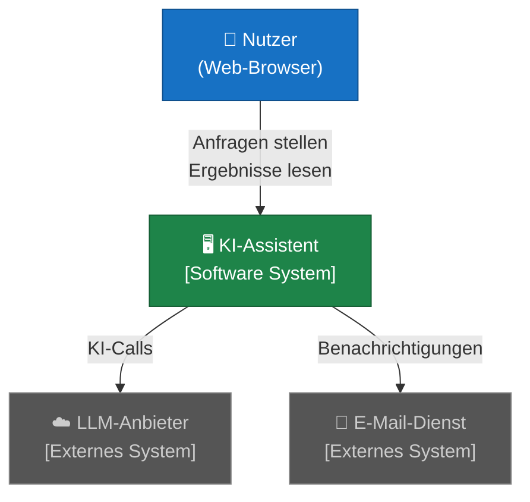
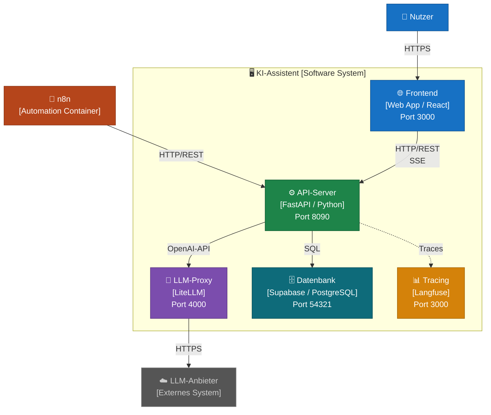
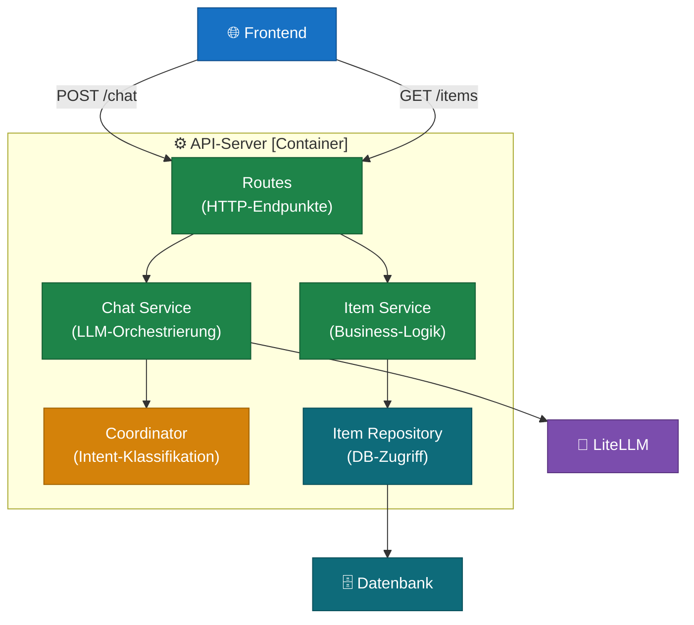
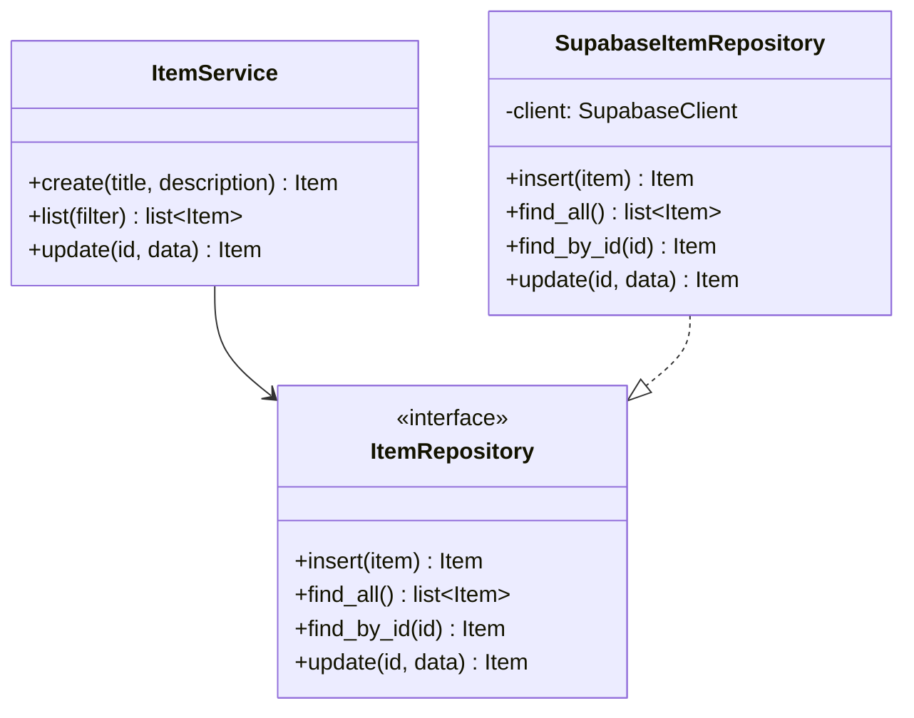
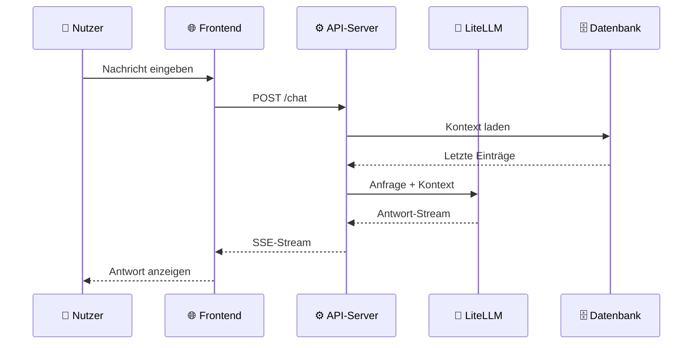

# C4-Modell & Architekturdiagramme

> 🟡 **Aufbauend** — empfohlen nach [01–05](README.md)

Sobald ein System wächst, stellt sich die Frage: Wie erkläre ich anderen (oder mir selbst in sechs Monaten) wie das System aufgebaut ist? Das C4-Modell gibt dafür einen klaren, stufenweisen Rahmen.

---

## Was ist das C4-Modell?

Das **C4-Modell** wurde von **Simon Brown** entwickelt und ist ein leicht erlernbares System zur Visualisierung von Softwarearchitektur. Der Name steht für die vier Abstraktionsebenen:

- **C**ontext
- **C**ontainer
- **C**omponent
- **C**ode

Die Grundidee: Je nach Gesprächspartner und Fragestellung brauchst du eine andere Detailtiefe. Ein Manager braucht den Kontext (Vogelperspektive), ein Entwickler braucht die Komponentensicht. Das C4-Modell gibt für jede Ebene ein eigenes Diagramm.

> *"A set of hierarchical abstractions — software systems, containers, components, and code."*
> — Simon Brown, c4model.com

---

## Die vier Ebenen

### Ebene 1 — System Context

Die höchste Abstraktionsebene. Zeigt das System als Black Box im Umfeld der Nutzer und externen Systeme. Keine technischen Details — nur: Wer benutzt das System, und mit welchen anderen Systemen spricht es?

**Frage:** *Welchen Platz nimmt unser System in der Welt ein?*

**Zielgruppe:** Alle — technisch und nicht-technisch. Dieses Diagramm sollte jeder im Team verstehen.

---

### Ebene 2 — Container

Zoomt in das System hinein und zeigt die deployierbaren Einheiten: Server, Datenbanken, Frontend-Applikationen, Worker-Prozesse. Nicht "Docker-Container" im Sinne von Docker — sondern jede eigenständig deploybare Einheit.

**Frage:** *Aus welchen laufenden Teilen besteht das System?*

**Zielgruppe:** Entwickler, Architekten, DevOps. Dieses Diagramm beantwortet "Was muss ich deployen?"

---

### Ebene 3 — Component

Zoomt in einen einzelnen Container und zeigt seine internen Bausteine — Module, Klassen, Services — und wie sie miteinander interagieren.

**Frage:** *Wie ist dieser Container intern aufgebaut?*

**Zielgruppe:** Entwickler. Dieses Diagramm passt zur Ordnerstruktur im Code (package-by-layer oder package-by-feature).

---

### Ebene 4 — Code

Die unterste Ebene — zeigt die Implementierung einzelner Komponenten: Klassen, Interfaces, Methoden. In der Praxis selten manuell gezeichnet, weil IDEs und Tools das automatisch generieren können.

**Frage:** *Wie ist diese Komponente im Code umgesetzt?*

**Zielgruppe:** Entwickler die an dieser Komponente arbeiten. Für kleinere Teams oft übersprungen — der Code selbst ist das Diagramm.

---

## Wann welche Ebene?

| Ebene | Zeigt | Für wen | Wann zeichnen |
|---|---|---|---|
| **Context** | System im Gesamtbild | Alle | Immer — am Anfang des Projekts |
| **Container** | Deploybare Einheiten | Entwickler, DevOps | Sobald mehrere Services existieren |
| **Component** | Interne Struktur eines Containers | Entwickler | Wenn ein Container komplex genug wird |
| **Code** | Klassen & Interfaces | Entwickler | Selten — nur für kritische Komponenten |

> **Empfehlung:** Fang mit Context und Container an. Component nur für komplexe Services. Code fast nie — der Code selbst ist besser.

---

## Ergänzende Diagrammtypen

Neben den vier Hauptebenen definiert C4 drei weitere Diagrammtypen für spezielle Fragen:

### System Landscape
Zeigt mehrere Systeme und ihre Beziehungen — sinnvoll wenn dein KI-Assistent Teil einer größeren Systemlandschaft ist (z.B. neben einem CRM, einem ERP, einer Datenplattform).

### Dynamic Diagram
Zeigt den **Ablauf** einer spezifischen Funktion quer durch die Container — ähnlich einem Sequenzdiagramm, aber im C4-Stil. Gut für: "Was passiert genau wenn ein Nutzer eine Anfrage stellt?"

### Deployment Diagram
Zeigt wie Container auf Infrastruktur verteilt sind — welcher Container läuft auf welchem Server, in welcher Cloud, in welchem Docker-Netzwerk.

---

## Werkzeuge

Das C4-Modell ist **notations- und toolunabhängig**. Du kannst es mit jedem Diagramm-Werkzeug umsetzen:

| Werkzeug | Typ | Besonderheit |
|---|---|---|
| [Structurizr](https://structurizr.com) | Web-Tool | Von Simon Brown, C4-nativ |
| [draw.io / diagrams.net](https://diagrams.net) | Web-Tool | C4-Shape-Bibliothek verfügbar |
| Mermaid | Code (Text) | In Markdown einbettbar — wie in diesen Docs |
| PlantUML | Code (Text) | C4-Erweiterung verfügbar |
| Excalidraw | Skizze | Für schnelle Entwürfe |

Für diese Dokumentationsreihe wird **Mermaid** verwendet — kein separates Tool nötig, direkt im Markdown.

---

## Quellen & Weiterführendes

### Offizielle Dokumentation

**c4model.com** — die primäre Quelle. Alle Ebenen, Notation, FAQ, interaktive Beispiele und Werkzeug-Empfehlungen.
→ [https://c4model.com](https://c4model.com)

Interaktives Beispiel (vollständige C4-Diagramme für ein reales System):
→ [https://c4model.com/example](https://c4model.com/example)

### Video

**"Visualising software architecture with the C4 model"**
Simon Brown — Agile on the Beach 2019. Der beste Einstieg: Simon Brown erklärt das Modell selbst, mit konkreten Beispielen und dem Vergleich zu anderen Ansätzen. ~45 Minuten.
→ [https://www.youtube.com/watch?v=x2-rSnhpw0g](https://www.youtube.com/watch?v=x2-rSnhpw0g)

### Buch

**"The C4 model for visualising software architecture"** — Simon Brown (O'Reilly).
Kompaktes Referenzwerk, auch als kostenloser Leanpub-Download verfügbar über c4model.com.

### Autor

**Simon Brown** — Softwarearchitekt, Autor, Trainer. Entwickler des C4-Modells.
→ [https://simonbrown.je](https://simonbrown.je)
