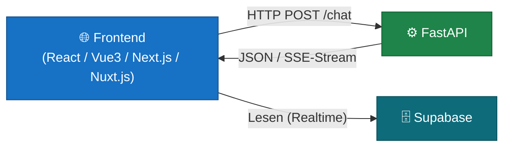

# Frontend-Optionen

> 🟡 **Aufbauend** — empfohlen nach [01–05](README.md)

Der Server (FastAPI) ist unabhängig davon, welches Frontend du verwendest — jedes Framework, das HTTP-Requests senden kann, funktioniert. Dieses Kapitel gibt einen Überblick über die gängigen Optionen.

---

## Wie das Frontend mit dem Server spricht

Das Frontend sendet HTTP-Requests an deine FastAPI und verarbeitet die JSON-Antworten. Das ist in allen Frameworks gleich — nur die Syntax unterscheidet sich.



Für Schreiboperationen (Daten senden, KI-Calls) immer durch den Server. Für Lesezugriffe (Tabellen anzeigen, Echtzeit-Updates) kann das Frontend Supabase direkt ansprechen.

---

## React

**Was es ist:** Eine JavaScript-Bibliothek (kein vollständiges Framework) für den Aufbau von UIs. React selbst macht nur das UI — für Routing, Server-Kommunikation und andere Funktionen braucht man separate Pakete.

**Stärken:**
- Größtes Ökosystem, die meisten Tutorials und Beispiele
- Viel Freiheit bei der Architektur
- Sehr gute TypeScript-Unterstützung

**Schwächen:**
- Kein Routing out-of-the-box (braucht z.B. React Router)
- "Blank canvas" — viele Entscheidungen muss man selbst treffen
- Kein SSR (Server-Side Rendering) ohne zusätzliche Werkzeuge

**Wann:** Wenn du maximale Kontrolle willst, viele Ressourcen findest oder im React-Ökosystem (React Native, etc.) bleiben möchtest.

**Anbindung an FastAPI:**
```typescript
const response = await fetch("/api/chat", {
    method: "POST",
    headers: { "Content-Type": "application/json" },
    body: JSON.stringify({ message: "Hallo" }),
});
const data = await response.json();
```

---

## Vue 3

**Was es ist:** Ein progressives JavaScript-Framework für UIs. Vue liegt zwischen React (Bibliothek) und Angular (vollständiges Framework) — es bringt mehr mit als React, ist aber weniger opinionated als Angular.

**Stärken:**
- Sanfte Lernkurve — gut für Einsteiger
- Klare, lesbare Template-Syntax
- Composition API (seit Vue 3) ist mächtig und flexibel
- Gute deutsche Dokumentation

**Schwächen:**
- Kleineres Ökosystem als React
- Weniger verbreitet in großen Unternehmen

**Wann:** Wenn du neu in Frontend-Entwicklung bist oder schnell produktiv sein willst. Vue ist oft der empfohlene Einstieg für Nicht-Frontend-Entwickler.

**Anbindung an FastAPI:**
```typescript
const { data } = await useFetch("/api/chat", {
    method: "POST",
    body: { message: "Hallo" },
});
```

---

## Next.js

**Was es ist:** Ein vollständiges React-Framework mit eingebautem Routing, Server-Side Rendering (SSR), Static Site Generation (SSG) und — seit Next.js 13 — Server Components.

**Stärken:**
- Full-Stack in einem Projekt: API-Routen + Frontend
- SEO-freundlich durch SSR/SSG
- Sehr gute Performance out-of-the-box
- Großes Ökosystem, breite Adoption

**Schwächen:**
- Eigene Abstraktionen können verwirrend sein (App Router vs. Pages Router)
- Komplex für simple Anwendungen
- Vendor-Lock-in auf Vercel für manche Features

**Wann:** Wenn du eine öffentlich zugängliche Anwendung baust, bei der SEO wichtig ist, oder wenn du React bereits kennst und ein vollständiges Framework möchtest.

**Besonderheit mit FastAPI:** Next.js hat eigene API-Routen — du könntest das Frontend und einen Teil der Backend-Logik in einem Projekt unterbringen. Für LLM-intensive Anwendungen ist ein separater FastAPI-Server aber oft besser (Python-Ökosystem, bessere async-Unterstützung für Streams).

---

## Nuxt.js

**Was es ist:** Dasselbe Konzept wie Next.js — aber für Vue statt React. Full-Stack Vue-Framework mit SSR, SSG, File-based Routing und eingebautem State Management.

**Stärken:**
- Vue-Ökosystem mit allen Next.js-Vorteilen (SSR, SSG)
- Sehr gute Developer Experience
- Auto-Import von Komponenten und Composables
- Nitro Server für API-Routen eingebaut

**Schwächen:**
- Kleineres Ökosystem als Next.js
- Weniger Ressourcen und Community-Plugins

**Wann:** Wenn du Vue bevorzugst und ein vollständiges Framework mit SSR brauchst — z.B. für öffentliche Websites mit KI-Features.

---

## Entscheidungshilfe

| Kriterium | React | Vue 3 | Next.js | Nuxt.js |
|---|---|---|---|---|
| Einsteigerfreundlich | Mittel | Hoch | Mittel | Mittel |
| Ökosystem / Community | Sehr groß | Groß | Sehr groß | Mittel |
| SSR / SEO | Nein | Nein | Ja | Ja |
| Full-Stack (FE + BE) | Nein | Nein | Ja | Ja |
| Basis | React | Vue | React | Vue |
| Empfehlung Einstieg | ✅ | ✅✅ | Bei React-Kenntnissen | Bei Vue-Kenntnissen |

**Für M4-Kursteilnehmer ohne Frontend-Erfahrung:** Vue 3 ist ein guter Einstieg. Die Template-Syntax ist lesbar, die Dokumentation gut und der Übergang zu Nuxt.js ist einfach wenn SSR nötig wird.

**Wenn du bereits Erfahrung mitbringst:** Wähle das Framework, das du kennst. Der FastAPI-Server ist für alle gleich — das Frontend ist austauschbar.

---

## Was alle gemeinsam haben

Unabhängig vom Framework gilt:

- HTTP-Calls an FastAPI funktionieren überall gleich (`fetch`, `axios`, etc.)
- Supabase hat offizielle Clients für JavaScript/TypeScript (`@supabase/supabase-js`)
- Streaming-Antworten (SSE) werden in allen Frameworks mit dem Streams-API des Browsers verarbeitet
- TypeScript ist in allen vier Frameworks erste Wahl — auch wenn JavaScript technisch funktioniert
