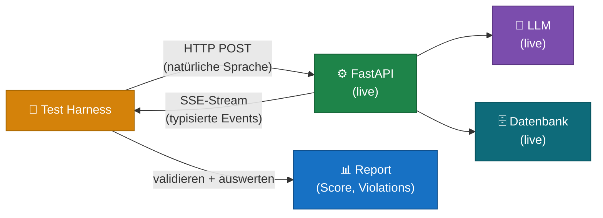
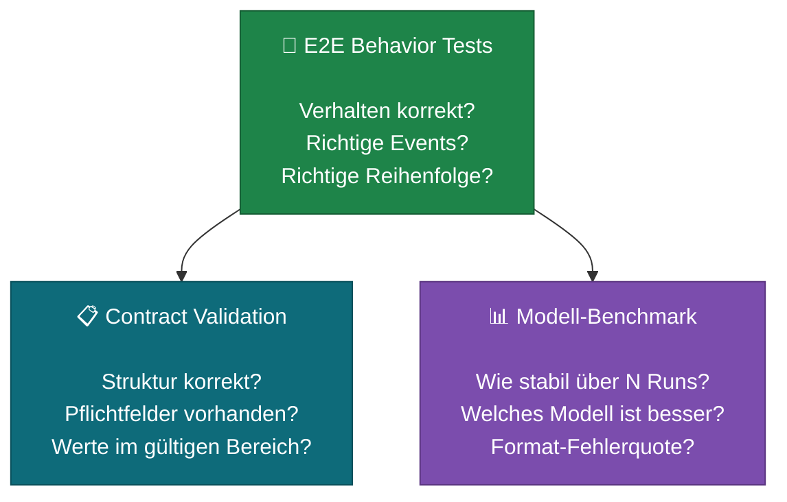
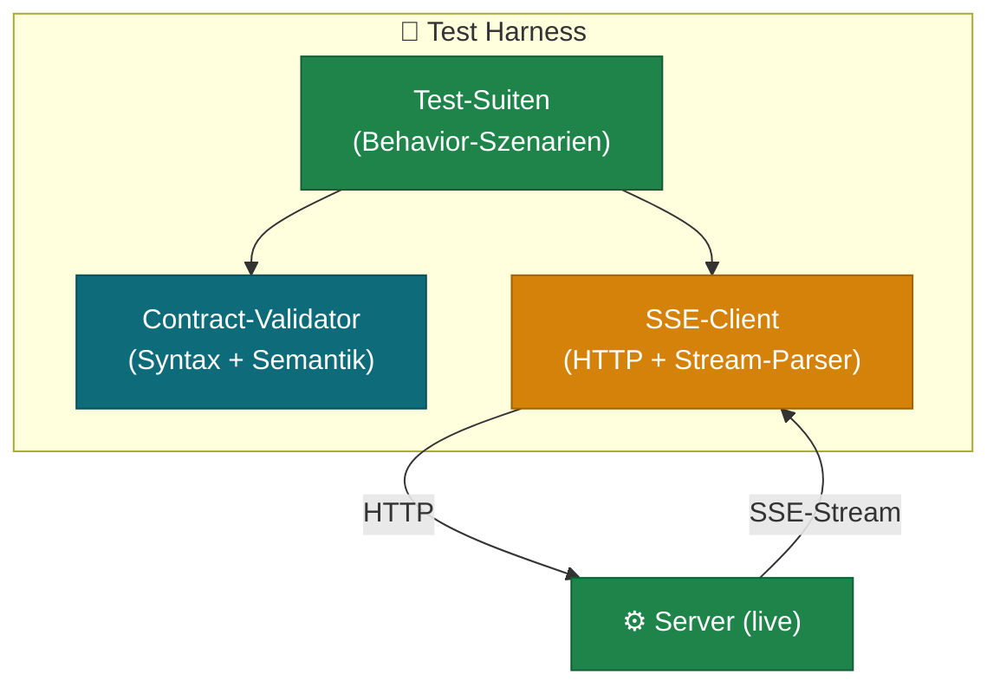
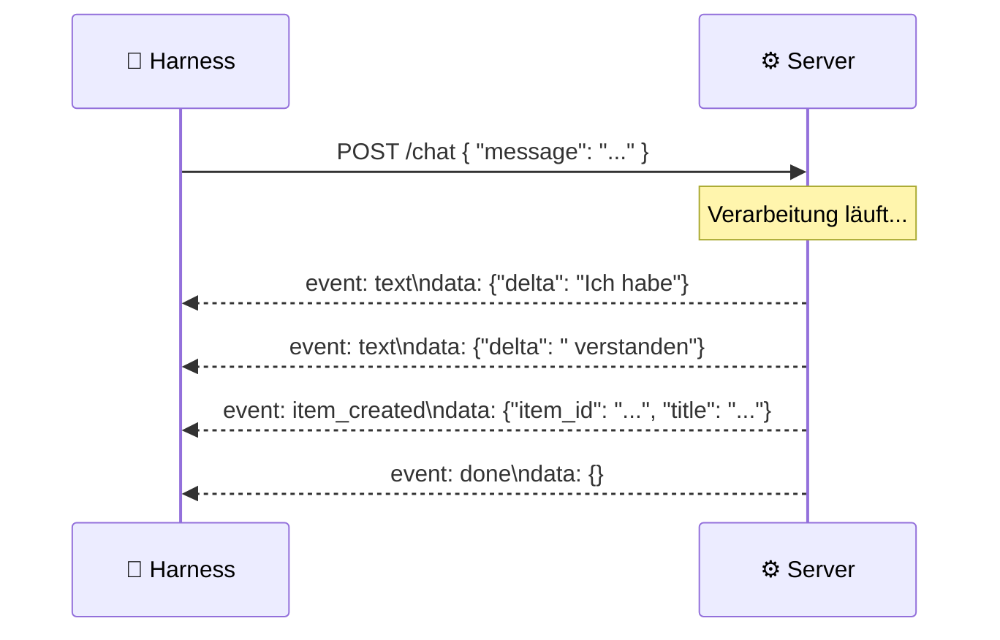
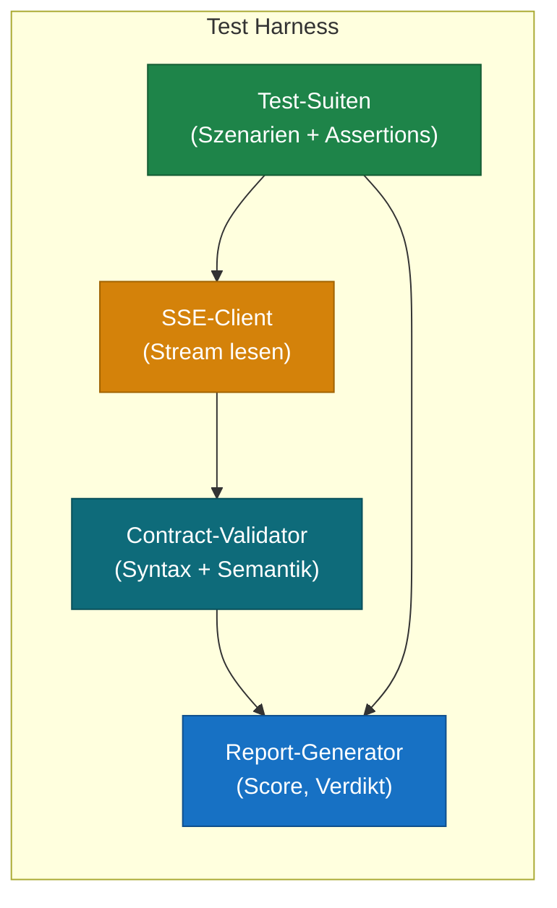

# LLM Integration Tests & Test Harness

> 🔴 **Fortgeschritten** — empfohlen wenn dein System produktionsnah werden soll

## Das Problem mit LLM-Tests

Normale Software verhält sich deterministisch: gleiche Eingabe, gleiche Ausgabe. Ein LLM nicht. Jeder Call kann eine leicht andere Antwort liefern, ein anderes JSON-Format wählen, oder eine Pflichtfeld-Eigenschaft auslassen — auch wenn das Modell "gut genug" ist.

Das erzeugt ein Testproblem, das Unit-Tests nicht lösen können:

| Testart | Was wird getestet | Problem bei LLMs |
|---|---|---|
| Unit-Test mit Mock | Die eigene Logik gegen eine simulierte Antwort | Der Mock antwortet immer korrekt — das echte Modell nicht |
| Unit-Test ohne Mock | Einzelne Funktionen isoliert | LLM-Verhalten entsteht erst im Zusammenspiel |
| **Integration-Test gegen Live-System** | **Das echte Verhalten des Gesamtsystems** | **Das ist das Ziel** |

> **Kernprinzip:** Mocks testen Mocks. Wer das LLM-Verhalten sicherstellen will, muss gegen den echten Stack testen.

---

## Was ist ein LLM-Test-Harness?

Ein **Test Harness** ist ein Rahmenwerk, das automatisierte Tests gegen ein laufendes System ausführt, Ergebnisse sammelt und bewertet. Im LLM-Kontext bedeutet das:



Der Harness schickt echte Nachrichten (natürliche Sprache) an den echten Server, liest die echten SSE-Events, und prüft ob Struktur und Inhalt den Erwartungen entsprechen.

---

## Drei Testebenen

Ein vollständiger LLM-Harness braucht drei Testebenen, die unterschiedliche Fragen beantworten:



### Ebene 1 — E2E Behavior Tests

Testen ob das System auf Eingaben in natürlicher Sprache **korrekt reagiert**. Nicht ob der Code korrekt aufgerufen wird — ob das Ergebnis korrekt ist.

Typische Fragen:
- Erstellt das System bei dieser Eingabe das richtige Event?
- Wird ein Duplikat erkannt wenn es eines gibt?
- Bleibt das System bei sachfremden Eingaben auf Kurs?

### Ebene 2 — Contract Validation

Prüft ob die Antwort-Struktur dem **definierten Vertrag** entspricht — unabhängig vom Inhalt. Zweischichtig:

**Syntaktischer Contract:** Pflichtfelder vorhanden? Typen korrekt?
```python
# Beispiel: Ein "item_created"-Event muss diese Felder haben
assert "item_id" in event          # Pflichtfeld
assert isinstance(event["confidence"], float)  # Typ
assert 0.0 <= event["confidence"] <= 1.0       # Wertebereich
```

**Semantischer Contract:** Ist der Inhalt sinnvoll?
```python
# Beispiel: confidence < 0.7 muss hitl_required=True auslösen
if event["confidence"] < 0.7:
    assert event["hitl_required"] is True
```

### Ebene 3 — Modell-Benchmark

Führt denselben Test mehrfach aus und misst **Stabilität** — nicht "hat der Test bestanden", sondern "wie oft hat er bestanden". Erlaubt den Vergleich von Modellen.

```
Modell A: 94% (32/34 Fälle) — stabil
Modell B: 78% (26/34 Fälle) — wackelig bei Grenzfällen
Modell C: 56% (19/34 Fälle) — instabil, zu viele Format-Fehler
```

Das gibt eine datenbasierte Antwort auf die Frage: *"Welches Modell ist gut genug für Produktion?"*

---

## Aufbau eines Harness

### Schichtenmodell



**SSE-Client** — liest den Stream, extrahiert typisierte Events:
```python
class ChatResult:
    def has(self, event_type: str) -> bool: ...
    def get(self, event_type: str) -> dict: ...
    def violations(self) -> list[str]: ...   # Contract-Verletzungen
```

**Contract-Validator** — prüft jedes Event gegen den definierten Vertrag:
```python
def validate_event(event_type: str, data: dict) -> list[str]:
    violations = []
    # Syntax
    for field in REQUIRED_FIELDS[event_type]:
        if field not in data:
            violations.append(f"Pflichtfeld fehlt: {field}")
    # Semantik
    if event_type == "item_created":
        if data.get("confidence", 1.0) < 0.7 and not data.get("hitl_required"):
            violations.append("hitl_required muss True sein wenn confidence < 0.7")
    return violations
```

**Test-Suite** — definiert Szenarien und Erwartungen:
```python
class Suite:
    name: str
    cases: list[TestCase]
    threshold: float = 0.8   # ≥80% = STABIL

def run_suite(suite: Suite, backend) -> SuiteResult:
    results = []
    for case in suite.cases:
        result = backend.chat(case.prompt)
        passed = case.assertion(result)
        results.append(TestResult(case, passed, result.violations()))
    score = sum(r.passed for r in results) / len(results)
    return SuiteResult(suite.name, score, results)
```

---

## SSE-Streaming verstehen

LLM-Antworten kommen typischerweise als **Server-Sent Events (SSE)** — ein kontinuierlicher HTTP-Stream statt einer einzelnen JSON-Antwort. Der Harness muss diesen Stream korrekt lesen.



Ein SSE-Stream besteht aus Blöcken:
```
event: item_created
data: {"item_id": "abc123", "title": "Neue Aufgabe", "confidence": 0.89}

event: done
data: {}
```

Der SSE-Client liest in Chunks, dekodiert UTF-8 inkrementell (wichtig für Sonderzeichen wie ä, ö, ü) und baut daraus typisierte Event-Objekte.

---

## Testsuiten strukturieren

Gut strukturierte Test-Suiten trennen **verschiedene Risiken** in separate Gruppen. Beispiel für einen KI-Assistenten:

| Suite | Testet | Risiko |
|---|---|---|
| 1 — One-Shot | Klare Eingabe → korrektes Event | LLM versteht einfache Anfragen nicht |
| 2 — Mehrdeutige Eingabe | Vage Formulierungen | LLM rät falsch oder bricht ab |
| 3 — Multi-Turn | Gesprächsverlauf | Kontext geht verloren |
| 4 — Duplikat-Erkennung | Ähnliche Eingabe → Duplikat-Event | Ähnlichkeit nicht erkannt |
| 5 — False Positives | Verschiedene Eingaben → kein Duplikat | Zu aggressive Duplikat-Erkennung |
| 6 — Off-Topic | Sachfremde Eingaben | LLM antwortet trotzdem |
| 7 — Org-Isolation | Mehrere Mandanten | Datenlecks zwischen Mandanten |

Jede Suite hat ein eigenes Erfolgskriterium. Suite 4 (Duplikat) darf strenger sein als Suite 2 (Mehrdeutigkeit), weil Duplikate ein Datenproblem sind.

### Multi-Turn: Kontext über mehrere Nachrichten

Wenn dein System Gesprächsverläufe unterstützt, muss der Harness Kontext über mehrere Nachrichten hinweg tracken:

```python
# Nachricht 1: Neues Item erstellen
r1 = backend.chat("Neue Aufgabe: Server-Update planen")
item_id = r1.get("item_created")["item_id"]

# Nachricht 2: Vorhandenes Item referenzieren
r2 = backend.chat(
    "Das ist dringend, bitte priorisieren",
    context={"item_id": item_id}   # ← Kontext-Injektion
)
assert r2.has("item_updated")
assert r2.get("item_updated")["item_id"] == item_id
```

---

## Verdikt und Reporting

Weil LLMs nicht 100% deterministisch sind, wird nicht "bestanden/nicht bestanden" gemessen — sondern ein **Stabilitäts-Score**:

```
Suite 1 — One-Shot       ✅ STABIL    94%  (17/18 Fälle)
Suite 2 — Mehrdeutig     ✅ STABIL    83%  (15/18 Fälle)
Suite 3 — Multi-Turn     ⚠️ WACKELIG  67%  (12/18 Fälle)
Suite 4 — Duplikate      ✅ STABIL    89%  (8/9 Fälle)
Suite 5 — False Pos.     ✅ STABIL    100% (6/6 Fälle)
Suite 6 — Off-Topic      ❌ INSTABIL  44%  (4/9 Fälle)
─────────────────────────────────────────────────────
Gesamt                                81%  (62/76 Fälle)
```

Schwellenwerte:
- **≥ 80%** → ✅ STABIL — produktionstauglich
- **≥ 50%** → ⚠️ WACKELIG — weitere Kalibrierung nötig
- **< 50%** → ❌ INSTABIL — nicht produktionstauglich

Das Report-Format erlaubt außerdem den **Modell-Vergleich**: den gleichen Harness gegen mehrere Modelle laufen lassen und Reports nebeneinander legen.

---

## Wann lohnt sich ein Test Harness?

Ein vollständiger Harness ist Aufwand. Er lohnt sich wenn:

- Das System **LLM-generierte Strukturdaten** produziert (JSON, Events, Klassifikationen)
- **Mehrere Modelle** evaluiert werden sollen
- Das System **in Produktion** geht und Regressionstests gebraucht werden
- Das **Verhalten sich mit Prompt-Änderungen** ändern kann und diese Änderungen nachweisbar sicher sein müssen

Für einen frühen Prototypen reicht manuelle Prüfung. Ab dem Moment wo Prompt-Änderungen Risiko tragen — ist ein Harness die richtige Investition.

---

## Zusammenfassung: Bausteine eines LLM-Harness



| Baustein | Aufgabe |
|---|---|
| SSE-Client | HTTP-Stream lesen, Events extrahieren, UTF-8 korrekt dekodieren |
| Contract-Validator | Pflichtfelder, Typen, semantische Konsistenz prüfen |
| Test-Suiten | Szenarien in natürlicher Sprache + Erwartungen definieren |
| Report-Generator | Score aggregieren, Verdikt vergeben, Modelle vergleichen |

Kein Mock. Kein simuliertes Verhalten. Echter Stack, echte Events, echte Bewertung.
