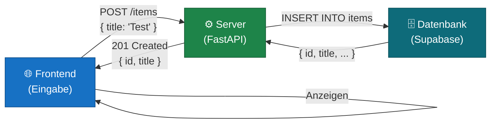
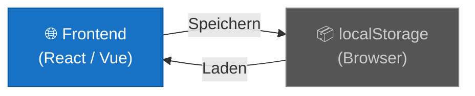
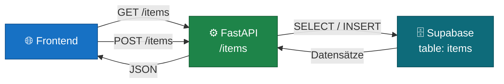
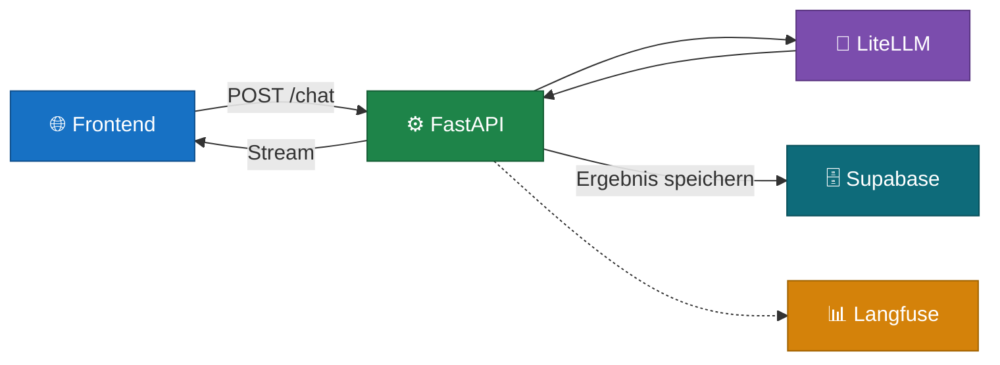
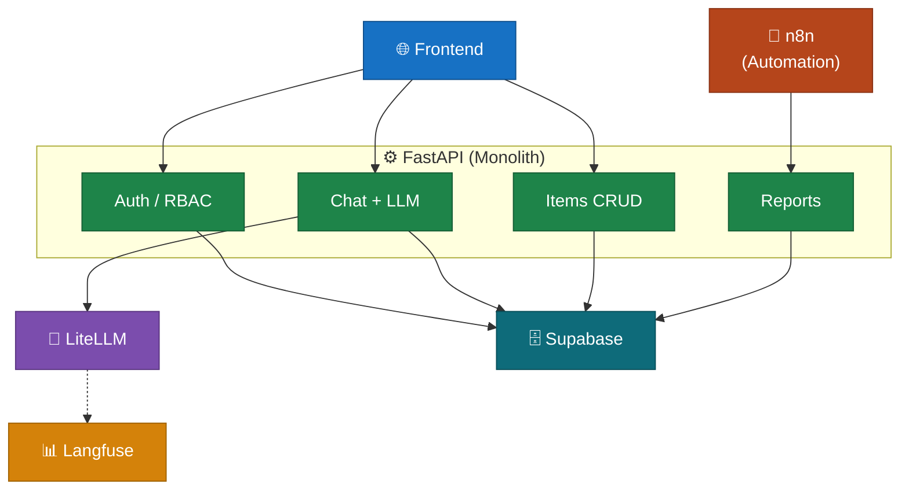

# Architektur-Konzept: Das Walking Skeleton

> 🟡 **Aufbauend** — empfohlen nach [01–05](README.md)

## Definition & Kernphilosophie

Ein **Walking Skeleton** ist die kleinstmögliche, aber vollständig funktionsfähige End-to-End-Verbindung durch alle maßgeblichen Schichten einer Software-Architektur.

Es handelt sich dabei nicht um einen theoretischen Prototypen (Mockup) oder eine reine UI-Simulation, sondern um **echten, lauffähigen Code**. Das primäre Ziel ist es, den gesamten technischen Stromkreis des Systems — von der Benutzeroberfläche über die Verarbeitungslogik bis hin zur Datenhaltung und wieder zurück — so früh wie möglich einmal komplett zu schließen. Erst wenn diese grundlegende Statik steht, wird schrittweise funktionale Tiefe hinzugefügt.

> **Kurzformel:** Skelett zuerst — dann Fleisch an die Knochen.

---

## Der geschlossene Stromkreis

Das Walking Skeleton stellt sicher, dass Infrastruktur und Kommunikationswege zwischen den Systemkomponenten real existieren und Daten fehlerfrei transportieren können:



Jede Komponente existiert, jede Verbindung ist real. Die Funktionalität ist minimal — aber das System *lebt*.

---

## Von POC zu Walking Skeleton: ein Beispiel

Viele Projekte starten als schneller Proof-of-Concept direkt im Browser — ohne Server, ohne Datenbank. Das ist sinnvoll zum Ausprobieren. Der Schritt zum Walking Skeleton ist der Moment, in dem der POC in eine echte Architektur überführt wird.

### Stufe 0 — Frontend-POC mit localStorage

Alles läuft im Browser. Keine API, keine Datenbank — Daten werden im `localStorage` des Browsers gespeichert.



**Was funktioniert:**
- UI kann entwickelt und getestet werden
- Schnelles Iterieren ohne Server-Setup
- Kein Backend nötig

**Was fehlt:**
- Daten verschwinden beim Browser-Wechsel oder Gerätewechsel
- Kein anderer Nutzer sieht die Daten
- Keine KI-Integration möglich (LLM-Calls brauchen einen Server)
- Keine echte Persistenz

```typescript
// Typisches localStorage-Muster im POC
const items = JSON.parse(localStorage.getItem('items') || '[]')
items.push({ id: crypto.randomUUID(), title: 'Neue Aufgabe' })
localStorage.setItem('items', JSON.stringify(items))
```

---

### Stufe 1 — Walking Skeleton (FE + API + DB)

Der minimale Schritt: Frontend spricht mit einem echten Server, der Server schreibt in eine echte Datenbank. Noch kein LLM, keine Authentifizierung, keine komplexe Logik — aber der Stromkreis ist geschlossen.



**Was sich ändert:**

| | POC (localStorage) | Walking Skeleton |
|---|---|---|
| Datenspeicherung | Browser-lokal | Datenbank (Supabase) |
| Mehrere Nutzer | Nein | Ja |
| Geräteübergreifend | Nein | Ja |
| Servercode nötig | Nein | Ja (FastAPI) |
| LLM-Integration möglich | Nein | Ja |

**Minimale FastAPI-Route (Walking Skeleton):**

```python
# routes/items.py — bewusst minimal
@router.get("/items")
async def list_items(repo: ItemRepository = Depends(get_repo)):
    return await repo.get_all()

@router.post("/items", status_code=201)
async def create_item(title: str, repo: ItemRepository = Depends(get_repo)):
    return await repo.create(title)
```

**Minimale Supabase-Tabelle:**

```sql
-- supabase/migrations/20260101000001_init_items.sql
CREATE TABLE items (
    id    UUID PRIMARY KEY DEFAULT gen_random_uuid(),
    title TEXT NOT NULL,
    created_at TIMESTAMPTZ NOT NULL DEFAULT NOW()
);
```

Das ist das Walking Skeleton: zwei Endpunkte, eine Tabelle, kein localStorage mehr.

---

### Stufe 2 — LLM-Integration

Der Stromkreis steht — jetzt kann KI hinzugefügt werden. Ein neuer Endpunkt ruft LiteLLM auf, das Ergebnis wird gespeichert.



Die Grundstruktur bleibt identisch — nur neue Endpunkte und Tabellen kommen dazu. Das Walking Skeleton hat dafür gesorgt, dass alle Verbindungen bereits funktionieren.

---

### Stufe 3 — Vollständiges System

Erst hier kommen Authentifizierung, Rollen, komplexe Business-Logik, n8n-Automatisierungen und weitere Features. Die Architektur ist bereits bewiesen — es wird nur noch ausgebaut.



---

## Warum Walking Skeleton statt "alles auf einmal"?

| Ansatz | Problem |
|---|---|
| Alles parallel bauen | Fehler in der Infrastruktur werden erst spät entdeckt |
| UI fertig stellen, dann Backend | UI-Annahmen passen oft nicht zur API-Realität |
| Backend fertig stellen, dann UI | Keine frühe Validierung ob das System tatsächlich nutzbar ist |
| **Walking Skeleton** | **Infrastruktur und Kommunikation sind sofort nachweisbar funktionsfähig** |

Das Walking Skeleton ist kein Kompromiss — es ist eine bewusste Entscheidung, Risiko früh zu eliminieren. Technische Probleme (Datenbank nicht erreichbar, CORS-Fehler, falsche API-Struktur) tauchen bei drei Zeilen Code auf, nicht nach drei Wochen Arbeit.

---

## Checkliste: Ist dein Walking Skeleton vollständig?

- [ ] Frontend kann Daten an den Server schicken (POST)
- [ ] Server schreibt die Daten in die Datenbank
- [ ] Frontend kann Daten vom Server abrufen (GET)
- [ ] Daten überleben einen Server-Neustart
- [ ] Das System ist auf einem anderen Rechner startbar (Docker / `.env`)
- [ ] Ein anderer Nutzer kann dieselben Daten sehen

Wenn alle sechs Punkte erfüllt sind: das Skelett geht. Jetzt kann gebaut werden.

---

## Quellen & Ursprung

Das Walking-Skeleton-Konzept wurde nicht für eine bestimmte Technologie erfunden — es ist ein allgemeines Architekturprinzip, das unabhängig von Stack oder Sprache gilt.

### Alistair Cockburn — Ursprung des Begriffs

Der Begriff *Walking Skeleton* geht auf **Alistair Cockburn** zurück, einen der Mitautoren des Agilen Manifests (2001) und Begründer der Crystal-Methodenfamilie. Seine Definition:

> *"A Walking Skeleton is a tiny implementation of the system that performs a small end-to-end function. It need not use the final architecture, but it should link together the main architectural components. The architecture and the functionality can then evolve in parallel."*

Quelle: Cockburn, A. — *Crystal Clear: A Human-Powered Methodology for Small Teams* (2004), Addison-Wesley.

Website: [alistair.cockburn.us](https://alistair.cockburn.us)

### Freeman & Pryce — Popularisierung durch TDD

Das Konzept wurde durch **Steve Freeman** und **Nat Pryce** einem breiten Publikum bekannt gemacht. In ihrem Buch *Growing Object-Oriented Software, Guided by Tests* (2009) ist das Walking Skeleton das zentrale Einstiegsmuster für testgetriebene Softwareentwicklung: erst den End-to-End-Pfad aufbauen und mit einem Acceptance-Test absichern, dann schrittweise Funktionalität hinzufügen.

> *"We use the term Walking Skeleton for the thinnest possible slice of real functionality that we can automatically build, deploy, and test end-to-end."*

Quelle: Freeman, S. & Pryce, N. — *Growing Object-Oriented Software, Guided by Tests* (2009), Addison-Wesley. ISBN 978-0-321-50362-6.

### Einordnung

| Person | Beitrag |
|---|---|
| Alistair Cockburn | Prägte den Begriff, definierte das Konzept im Kontext agiler Methodik |
| Steve Freeman & Nat Pryce | Verankerten es als zentrales TDD-Muster mit konkreter Umsetzungsanleitung |
