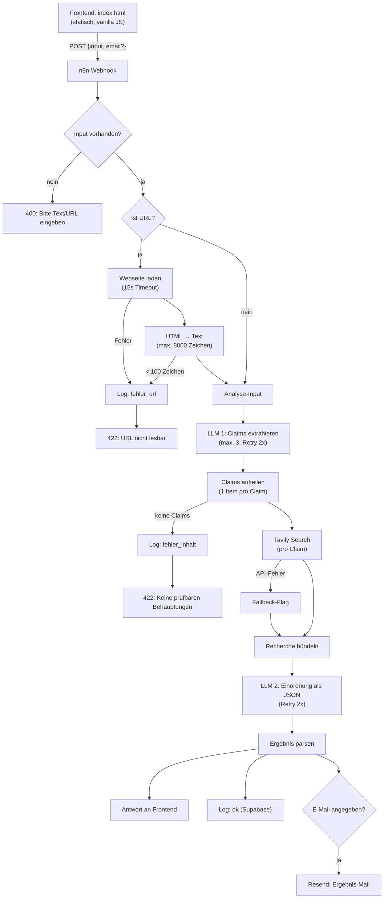

# Hype-Check – AI News nüchtern einordnen

**Projekt 1 (M4, Woche 4–5) – Beispielprojekt**

## Problem & Ziel

AI-News und Social-Media-Posts erzeugen Unsicherheit: Was ist belegt, was ist Hype?
Hype-Check nimmt einen Text oder eine offene Web-URL entgegen und liefert eine
strukturierte Einordnung: Welche Behauptungen werden aufgestellt, was davon ist
belegt vs. Spekulation, und was bedeutet das konkret für Lernende im AI-Bereich.

**Bewusst kein Faktencheck-Anspruch:** Das Tool ordnet ein, es urteilt nicht binär
über wahr/falsch. Die Bewertung stützt sich auf eine automatische Websuche und ist
nur so gut wie deren Ergebnisse.

## Scope

| In Scope | Out of Scope (bewusste Entscheidung) |
|---|---|
| Text-Eingabe (kopierte Captions, Artikel) | Video-/Social-Media-Links (YouTube, Instagram, TikTok, X, Facebook) – per Blocklist abgewiesen, da Inhalte nicht per Server-Fetch abrufbar |
| Offene Web-URLs (Newsseiten, Blogs) | Login-/Paywall-Inhalte |
| Web-Verifikation pro Claim via Tavily | Video-/Audio-Analyse |
| Ergebnis auf der Seite + optional per E-Mail | Nutzerverwaltung, Historie im Frontend |

## Architektur



## Output-Schema

```json
{
  "zusammenfassung": "1–2 Sätze: Worum geht es?",
  "claims": [
    {
      "behauptung": "...",
      "bewertung": "belegt | teilweise belegt | spekulation | nicht prüfbar",
      "begruendung": "...",
      "quellen": ["url1", "url2"]
    }
  ],
  "hype_score": 7,
  "hype_score_begruendung": "...",
  "takeaways": ["Was heißt das konkret für mich als Lernende:r?"],
  "verifikation_aktiv": true,
  "quelle_url": null,
  "analysiert_am": "ISO-Timestamp"
}
```

## API-Übersicht

| API | Zweck | Auth (n8n) | Endpunkt |
|---|---|---|---|
| OpenRouter | LLM-Aufrufe (Claims extrahieren, Einordnung erstellen) | OpenRouter-Credential (predefinedCredentialType) | `POST /api/v1/chat/completions`, Modell `openai/gpt-4o-mini` |
| Tavily | Websuche zur Claim-Verifikation | Bearer (httpBearerAuth) | `POST https://api.tavily.com/search` |
| Resend | Ergebnis-Mail | Bearer (httpBearerAuth) | `POST https://api.resend.com/emails` |
| Supabase | Logging aller Runs | Supabase-Credential (Service Key) | Tabelle `hype_check_runs` |

## Fehlerszenarien

| # | Szenario | Verhalten |
|---|---|---|
| 1 | Leerer / ungültiger Input | 400 mit Fehlermeldung im Frontend |
| 2 | Video-/Social-Media-URL (Blocklist) | 422 mit Hinweis, Titel/Beschreibung bzw. Post-Text einzufügen; Log `fehler_url` |
| 2b | URL nicht erreichbar oder zu wenig lesbarer Text | 422 mit Hinweis, Text direkt einzufügen; Log `fehler_url` |
| 3 | Keine prüfbaren Behauptungen im Text | 422 mit Hinweis; Log `fehler_inhalt` |
| 4 | Tavily-API-Fehler | Einordnung läuft weiter ohne Verifikation, `verifikation_aktiv: false`, Hinweis im Ergebnis |
| 5 | LLM-Fehler | Automatischer Retry (2x) |
| 6 | Resend- oder Supabase-Fehler | Blockiert die Nutzer-Antwort nie (`continueRegularOutput`) |

## Logging & Monitoring

Jeder Run schreibt eine Zeile in die Supabase-Tabelle `hype_check_runs`:
Timestamp, Input-Typ (text/url), gekürzter Input, Quelle-URL, Hype-Score,
Verifikations-Status und Run-Status (`ok`, `fehler_url`, `fehler_inhalt`).
Zweite Ebene: n8n Execution Log.

## Bekannte Einschränkungen

- Social-Media-Links werden nicht gescrapt – Text muss kopiert werden
- Verifikation hängt von Tavily-Suchergebnissen ab; keine Garantie für Vollständigkeit oder Aktualität
- Resend im Test-Mode: Mails gehen immer an die im Workflow hinterlegte verifizierte Adresse, nicht an die eingegebene
- Synchrone Webhook-Response: Analyse dauert ~20–40 s, Frontend zeigt Loading-State
- HTML-zu-Text-Extraktion ist Regex-basiert (bewusst einfach gehalten); bei stark dynamischen Seiten unvollständig
- Englischsprachige Claims liefern meist bessere Verifikationsergebnisse (deshalb extrahiert LLM 1 englische Claims)

## Stolpersteine & Learnings aus der Umsetzung

1. **Publizieren nicht vergessen:** Der Produktiv-Webhook bedient nur die publizierte
   Workflow-Version. Änderungen am Entwurf sind erst nach erneutem Publizieren live –
   das hat im Test zunächst zu scheinbar „ignorierten" Fixes geführt.
2. **Fehler in Code-Nodes brauchen eigene Error-Branches:** Ein `throw` in einem
   Code-Node beendet sonst die Execution als generischer Fehler – der Client bekommt
   eine leere Antwort statt einer sauberen Fehlermeldung. Lösung: Error-Output
   aktivieren und auf Log + Respond-Node routen.
3. **Side Effects parallel und fehlertolerant:** Logging und Mail laufen nach der
   Frontend-Antwort und mit `continueRegularOutput` – ein Ausfall dort darf den
   Nutzer nie treffen.
4. **Graceful Degradation statt Abbruch:** Fällt die Such-API aus, liefert das Tool
   trotzdem eine Einordnung – transparent als „ohne Verifikation" markiert.

## Dateien

| Datei | Inhalt |
|---|---|
| `workflow.json` | n8n-Workflow-Export (Import über n8n: Workflows → Import from File) |
| `frontend/index.html` | Statisches Frontend (Webhook-URL anpassen, dann lokal öffnen) |
| `SETUP.md` | Schritt-für-Schritt-Einrichtung |
| `TESTING.md` | Test-Tabelle mit 12 Fällen und Ergebnissen |
